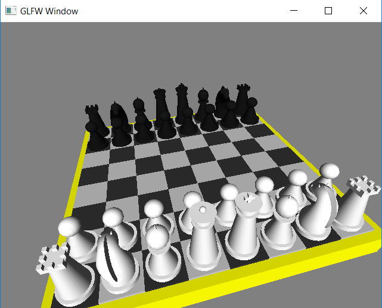

# 3D chess board model
3d model of chess board created with GLFW 2.7

### Building with MinGW
```
gcc -Wall -c chess.c -o chess.o -I include
gcc -Wall chess.o -o chess.exe -L lib -L [Path to MinGW/lib] -lglfw -lopengl32 -lglu32
```

### Screenshots




